# 🏗️ Architecture & Methodology: SmartAgent-ER

This document provides a deep dive into the technical architecture, agent methodologies, and data flow protocols of the **SmartAgent-ER** system.

---

## 1. System Architecture Diagram

The system follows a **Hub-and-Spoke** architecture where the **LangGraph State** acts as the central hub (Blackboard), and agents act as specialized spokes.

```mermaid
graph TD
    %% Actors
    User((Citizen))
    Paramedic((Paramedic))
    
    %% Identity Layer
    subgraph "🛡️ Trust Layer (Zynd AI)"
        Gatekeeper[Identity Gatekeeper]
        DID_Registry[(DID Registry)]
    end

    %% Core Logic (LangGraph)
    subgraph "🧠 SmartAgent-ER Core (LangGraph)"
        State{Shared Global State}
        
        Dispatcher[🚑 Dispatcher Agent]
        Analyst[🔬 Analyst Agent]
        Triage[🏥 Triage Agent]
        Specialist[👨‍⚕️ Specialist Agent]
    end

    %% External APIs
    subgraph "External Services"
        GMaps[Google Maps API]
        LLM[Groq / OpenAI / Gemini]
        VectorDB[(FAISS Vector DB)]
    end

    %% Flow
    User -->|1. Report Emergency| Gatekeeper
    Gatekeeper <-->|2. Verify DID| DID_Registry
    Gatekeeper -->|3. Authorized Request| State
    
    State -->|4. Trigger| Dispatcher
    Dispatcher <-->|5. Get Traffic/ETA| GMaps
    Dispatcher -->|6. Assign Ambulance| State
    
    Paramedic -->|7. Upload Vitals/Images| Analyst
    Analyst <-->|8. Multimodal Analysis| LLM
    Analyst -->|9. Update Clinical Summary| State
    
    State -->|10. Trigger| Triage
    Triage -->|11. Score Hospitals| State
    
    State -->|12. Trigger| Specialist
    Specialist <-->|13. RAG Search| VectorDB
    Specialist -->|14. Final Handover| State
```

---

## 2. Agent Methodologies

Each agent in the system is designed with a specific cognitive architecture, utilizing different AI techniques suited for their specific tasks.

### 🚑 Dispatcher Agent (Logistics & Routing)
*   **Goal:** Minimize ETA (Estimated Time of Arrival).
*   **Methodology:** **Geospatial Optimization**.
*   **Algorithm:**
    1.  **Filter:** Select ambulances with `status="Available"` and `type` matching the severity (ALS for Critical, BLS for Stable).
    2.  **Distance Matrix:** Query Google Maps API to get real-time driving times (not just physical distance) for all candidates.
    3.  **Selection:** `min(ETA)` is selected.
*   **Input:** `accident_location`, `severity`
*   **Output:** `assigned_ambulance_id`, `eta`

### 🏥 Triage Agent (Resource Allocation)
*   **Goal:** Select the *most suitable* hospital, not just the nearest.
*   **Methodology:** **Multi-Criteria Decision Making (MCDM)**.
*   **Algorithm:** Weighted Linear Combination.
    $$ Score = w_1 \cdot (1 - D_{norm}) + w_2 \cdot I_{norm} + w_3 \cdot T_{score} $$
    *   $D_{norm}$: Normalized Distance (Lower is better).
    *   $I_{norm}$: Normalized ICU Bed Availability.
    *   $T_{score}$: Trauma Center Level (Level 1 = 1.0, Level 3 = 0.3).
    *   *Weights:* $w_1=0.4$ (Distance), $w_2=0.3$ (Resources), $w_3=0.3$ (Capability).
*   **Input:** `patient_vitals`, `injury_type`
*   **Output:** `selected_hospital_id`, `route_map`

### 👨‍⚕️ Specialist Agent (Knowledge Retrieval)
*   **Goal:** Identify the correct specialist and prepare them.
*   **Methodology:** **Retrieval-Augmented Generation (RAG)**.
*   **Algorithm:**
    1.  **Embedding:** Convert the `clinical_summary` (e.g., "ST Elevation, Chest Pain") into a 768-dimensional vector using `HuggingFaceEmbeddings`.
    2.  **Vector Search:** Query the **FAISS** database of doctor profiles to find the nearest neighbor (Cosine Similarity).
    3.  **Generation:** Use LLM to generate a handover checklist based on the matched doctor's specialty.
*   **Input:** `medical_analysis`
*   **Output:** `selected_doctor_id`, `prep_instructions`

### 🔬 Analyst Agent (Multimodal Perception)
*   **Goal:** Convert unstructured sensor data into structured clinical insights.
*   **Methodology:** **Multimodal Chain-of-Thought**.
*   **Pipeline:**
    1.  **Vision:** `Llama 3.2 Vision` analyzes images for visible injuries (fractures, burns) or ECG patterns.
    2.  **Audio:** `Whisper` (or equivalent) transcribes paramedic voice notes.
    3.  **Synthesis:** `GPT-4o` merges these inputs into a JSON object: `{"diagnosis": "STEMI", "severity": "Critical", "vitals": {...}}`.
*   **Input:** `images`, `voice_logs`
*   **Output:** `medical_handover_report`

---

## 3. Data Flow & Phased Workflow

The system operates in a strict phased manner to ensure data integrity and logical progression.

### Phase 0: Trusted Handshake (Zynd Identity Layer)
*   **Actor:** Citizen App / External Sensor.
*   **Action:** Initiates a request to the system.
*   **Security Check:** The **Coordinator Agent** challenges the app's DID (`did:zynd:citizen...`).
*   **Verification:** Checks for `Credential:Authorized_Responder`.
    *   *Success:* Proceed to Phase 1.
    *   *Failure:* Request rejected (Rogue Agent Prevention).

### Phase 1: Incident Reporting
*   **Actor:** Citizen.
*   **Data In:** Location (Lat/Lng), Incident Type (e.g., "Cardiac Arrest").
*   **System Action:** Creates a unique `request_id` and initializes the `AgentState`.
*   **Data Out:** `EmergencyRequest` object pushed to the Dispatcher Node.

### Phase 2: Intelligent Dispatch
*   **Actor:** Dispatcher Agent.
*   **Data In:** `EmergencyRequest`.
*   **System Action:** Filters fleet, calculates traffic-based ETA.
*   **Data Out:** Updates state with `assigned_ambulance` and triggers "En Route" status.

### Phase 3: On-Scene & Transport
*   **Actor:** Paramedic (Human) + Analyst Agent (AI).
*   **Data In:** Photos of injury/ECG, Voice Dictation.
*   **System Action:** 
    *   **Vision:** Detects "ST Elevation".
    *   **Voice:** Extracts "Patient pale, diaphoresis."
*   **Data Out:** `clinical_summary` added to State.

### Phase 4: Hospital Readiness
*   **Actor:** Triage Agent.
*   **Data In:** `clinical_summary`, Hospital Database.
*   **System Action:** Calculates scores for all hospitals.
    *   *Example:* Re-routes a stroke patient to a further hospital because the nearest one lacks a CT scanner.
*   **Data Out:** Reserves ICU bed and notifies Blood Bank.

### Phase 5: Specialist Handover
*   **Actor:** Specialist Agent.
*   **Data In:** `clinical_summary`, `selected_hospital`.
*   **System Action:** Vector Search matches "Interventional Cardiologist".
*   **Data Out:** Generates a comprehensive **Medical Handover Report** summarizing the entire timeline, vitals trends, and immediate action items.

### Phase 6: Dynamic Reallocation (Admin/System Level)
*   **Actor:** Admin / AI System.
*   **Data In:** `risk_profiles_kolkata.csv`, Real-time Ambulance Locations.
*   **System Action:** 
    *   Identifies high-risk zones (e.g., "Park Street" on a Friday night).
    *   Checks for idle ambulances in low-risk zones.
    *   Generates a **Reallocation Plan** (e.g., "Move AMB-004 to Park Street").
*   **Data Out:** Visualized route map and actionable "Apply Plan" buttons for the Admin.

---

## 4. Detailed System Layers

The system follows a **Hub-and-Spoke Agentic Architecture** wrapped in a **Decentralized Identity Layer**.

### Layer 1: The Interaction Layer (Frontend)
*   **Component:** Streamlit Application (`app_enhanced.py`)
*   **Role:** Acts as the interface for distinct user personas, including the **Admin Command Center**.
    *   **Citizen:** Reports emergencies.
    *   **Admin:** Monitors the entire fleet, views live risk heatmaps, and approves AI-suggested fleet reallocations.
    *   **Paramedic:** Uploads live data.
    *   **Doctor/Hospital:** Views the incoming handover report.
*   **Connection:** It does not call the agents directly. It calls the **Zynd Wrapper**.

### Layer 2: The Trust Layer (Security)
*   **Component:** Zynd Identity Wrapper (`zynd_wrapper.py`)
*   **Role:** The "Gatekeeper".
*   **Mechanism:**
    *   Intercepts every request from the Frontend.
    *   Performs a **DID Handshake** (`verify_handshake`).
    *   Checks for **Verifiable Credentials** (e.g., `Credential:Authorized_Responder`).
    *   If valid, it passes the payload to the Core Engine. If invalid, it rejects the request.

### Layer 3: The Orchestration Layer (The Brain)
*   **Component:** LangGraph Core Engine (`core_engine.py`)
*   **Role:** Manages the state and workflow.
*   **Mechanism:**
    *   Maintains a **Shared Global State** (`AgentState` TypedDict).
    *   Executes a **Directed Acyclic Graph (DAG)** of nodes.
    *   Ensures data consistency (e.g., The Hospital Agent cannot run until the Ambulance Agent has assigned a vehicle).

### Layer 4: The Agent Layer (The Workers)
These are the independent nodes in the LangGraph.

*   **🚑 Dispatcher Agent:**
    *   **Input:** Location, Severity.
    *   **Tool:** Google Maps Distance Matrix API.
    *   **Logic:** Filters fleet CSV -> Queries API for traffic-based ETA -> Selects min(ETA).
    
*   **🔬 Analyst Agent:**
    *   **Input:** Images (Injury/ECG), Voice Logs.
    *   **Tool:** Llama 3.2 Vision (Groq) / GPT-4o.
    *   **Logic:** Multimodal analysis to extract clinical keywords (e.g., "STEMI", "Fracture").

*   **🏥 Triage Agent:**
    *   **Input:** Clinical Summary from Analyst.
    *   **Tool:** Pandas (Hospital CSV), Weighted Scoring Algorithm.
    *   **Logic:** Calculates $Score = w_1(Distance) + w_2(ICU) + w_3(Trauma)$.

*   **👨‍⚕️ Specialist Agent:**
    *   **Input:** Clinical Summary, Selected Hospital.
    *   **Tool:** FAISS Vector DB, HuggingFace Embeddings.
    *   **Logic:** Semantic Search (RAG) to match patient condition vector with doctor profile vector.

### Layer 5: The Data Layer (Storage)
*   **Static Data:** CSV files (`ambulances_kolkata.csv`, `hospitals_kolkata.csv`) act as the registry.
*   **Vector Data:** `doctor_faiss_index/` stores the embeddings of doctor profiles for fast retrieval.
*   **Dynamic Data:** In-memory `AgentState` passed between nodes.

---

## 5. Admin Command Center & Reallocation Logic

The **Admin Dashboard** is a critical component for city-wide situational awareness. It provides three key views:

### 1. Live Map (Situational Awareness)
*   **Visuals:** Displays real-time locations of all ambulances (Blue), hospitals (Green), and active incidents (Red).
*   **Features:**
    *   **Risk Heatmap:** Overlays a heatmap based on historical accident data (`risk_profiles_kolkata.csv`).
    *   **Active Route:** Draws the polyline path of any active emergency mission.

### 2. Fleet Status
*   **Data:** Tabular view of all ambulances, their current status (IDLE, DISPATCHED, MAINTENANCE), and equipment level (ALS/BLS).
*   **Utility:** Allows the admin to quickly identify resource bottlenecks.

### 3. Predictive Risk & Reallocation (AI-Driven)
*   **Problem:** Ambulances are often stationed in low-risk areas while high-risk zones (e.g., highways during rush hour) are uncovered.
*   **Solution:** The system proactively suggests moving idle ambulances to high-risk zones.
*   **Workflow:**
    1.  **Identify High Risk:** Sorts zones by `risk_score`.
    2.  **Identify Idle Resources:** Finds available ambulances.
    3.  **Generate Plan:** Creates a pairing (Ambulance A -> Zone B).
    4.  **Visualization:** Draws a dashed line on the map showing the proposed move.
    5.  **Execution:** Admin clicks "Apply Plan" to dispatch the unit (simulated).

---

## 6. Data Flow Summary

1.  **User** (Frontend) sends request → **Zynd Wrapper**.
2.  **Zynd Wrapper** verifies DID → triggers **LangGraph**.
3.  **LangGraph** initializes State.
4.  **Dispatcher Node** reads State → queries **Google Maps** → updates State (Ambulance Assigned).
5.  **Analyst Node** reads State (Images) → queries **Llama 3 Vision** → updates State (Clinical Report).
6.  **Triage Node** reads State (Report) → calculates **Scores** → updates State (Hospital Selected).
7.  **Specialist Node** reads State → queries **FAISS DB** → updates State (Doctor Matched).
8.  **LangGraph** returns final State → **Frontend** displays results.

